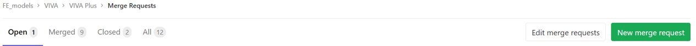
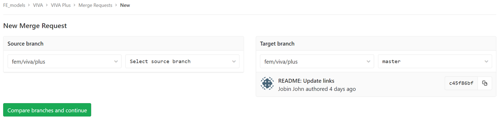

# **VIVA+ Git Workflow**

This section gives an overview of the workflow we follow for collaborative development of VIVA+ Models.

<!--- 
If you are new to git Workflow, you can find a brief introduction in the [Git Basics](../22-git-basics).
Other commonly used git functions are described in the [More Git Functions](../25-more-git-functions) section.

A brief overview of the git Workflow is provided here, but detailed help can be found in the
[Merging your contributions](../50-merge-guidelines) section. -->


!!! note "Introduction to Git: VIVA+ Workshop"
    
    A brief introduction to Git and workflow using branches can found on the [VIVA Workshop handouts](https://viva-workshop.readthedocs.io/en/latest/2-1-git-overview/)

## Step 1: **Clone** the model

_(Skip this step if you alrady have the VIVA+ repo on your computer)_

`git clone git@virtual.openvt.eu:fem/viva/plus.git`

## Step 2: Start an **Issue**

Start an issue on the online repo to let other users know and discuss the changes you propose.

## Step 3: Make a **Branch** to work on

#### Making a branch from `master` branch!

Create a branch `BranchName` for your development.

```
git checkout -b BranchName
```

??? tip "Git commands for branches" 
        

    `git checkout -b BranchName` is shorthand for:

    ```
    git branch BranchName
    git checkout BranchName
    ```

<!-- 
#### Make a branch from online VIVA+ repo
 -->

## Step 4: Saving your work as you go: **Commit**

Use `git add` to stage the files you want save (to index/staging area) and then `git commit` to take a snapshot of the staging area

```
git add FileNames
git commit -m "Commit message heading"
```

!!! Note "Guidelines for making commits"
    - Stage related files together from the working directory and perform the commit, rather than staging all the changed files for a bulk commit
    - Follow the commit message guidelines for VIVA+ models (read below)


!!! Info "How to write a commit message"
    - The commit heading gives a brief overview of changes involved
        - Specify the context of the change, for example, repository section (Model:, Docs:)
    - Commit message: If you would like to write more details of the commit, use the commit message body

A brief introduction to making `git commit` can be found in the [VIVA+ workshop handouts](https://viva-workshop.readthedocs.io/en/latest/2-3-git-basic-workflow/)

## Step 5: **Push** your branch to the online repo

Make your commits available on the online repo so that it has a backup and also visible to other developers.

```
git push origin BranchName
```

??? Warning "Warning: Before you push"
    Some applications interfere with `git push` and cause merge conflicts.
    Please close these applications before you merge branches to avoid merge conflicts.

    Applications to close:

        - Microsoft Excel (if you have a CSV file open)
        - JabRef (if you use it to edit BibTeX files)

## Step 6: Run **Model Tests**

!!! warning "Work in Progress"

    These model tests will be run to verify the performance and responses of the model
        


## Step 7: **Merging** your updates to the master branch

Once your changes are available on the online repo, you are ready to submit a **merge request** to the maintainer for review and merging to the master branch.



Select the branch you want to merge as the source branch and `master` as the target branch


