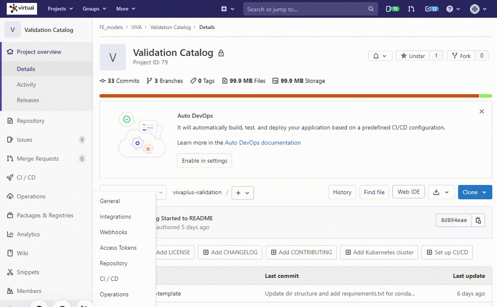
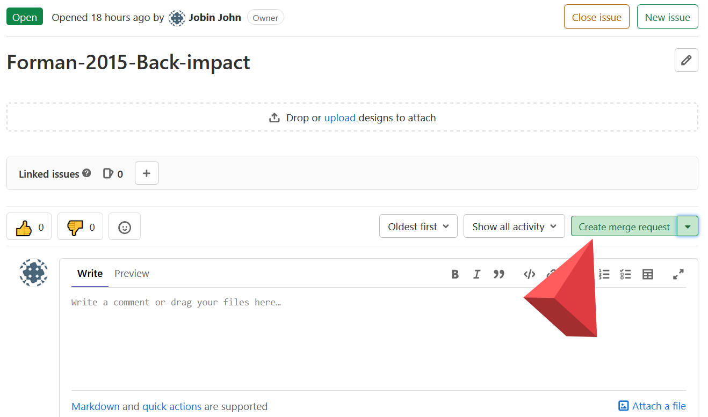

# Contributing to the Validation Catalog

All the validations for VIVA+ are documented in Jupyter notebooks. A separate repository is maintained to host all the validation load cases: [Validation Catalog](https://virtual.openvt.eu/fem/viva/vivaplus-validation)

!!! example "Golden Path: Making a validation notebook"

    - [Getting started](#getting-started)
        - [1. Start an issue for the new validation load case](#1-start-an-issue-for-the-new-validation-load-case)
        - [2. Create a branch](#2-create-a-branch)
    - [Setting up your validation directory](#setting-up-your-validation-directory)
        - [3. Get the VIVA+ Validation Repo](#3-get-the-viva-validation-repo)
        - [4. Start a new folder for the load case](#4-start-a-new-folder-for-the-load-case)
    - [Postprocessing your simulations](#postprocessing-your-simulations)
        - [5. Set up your environment](#5-set-up-your-environment)
        - [6. Starting Jupyter](#6-starting-jupyter)
        - [7. Using Dynasaur to postprocess](#7-using-dynasaur-to-postprocess)
    - [Preparing to publish on the VIVA+ Validation Catalog](#preparing-to-publish-on-the-viva-validation-catalog)
        - [8. Jupyter Cell Metadata](#8-jupyter-cell-metadata)
        - [9. Submit Merge Request](#9-submit-merge-request)
        - [10. Validation notebook review](#10-validation-notebook-review)
    

## Getting started

It is good practice to let the VIVA+ community know that you are working on the validation by creating an issue on the validation catalog repository.

### 1. Start an issue for the new validation load case

Open an issue on the repo with a description of the validation case. Give a brief  title for the issue: ExperimentAuthorLastName-Year-Load-case. Limit the load case keywords to 2-4 words. (In the next step, we use an automated method to make branches and keeping a short title will give you a not-so-long 'Branch name')



### 2. Create a branch

 By working on a branch, you can work independently on your load case without other changes in the repository affecting you.

 Recommended way to create a branch is by clicking `Create Merge Request` within the issue as shown below. This keeps your branch connected to the issue you created for the load case.



## Setting up your validation directory

The following steps assume that you have Git installed on your system.

### 3. Get the VIVA+ Validation Repo and Validation Branch

If you don't have a copy of the validation repo on your computer, use `git clone` to start a local repo.

```
git clone --recurse-submodules git@virtual.openvt.eu:fem/viva/vivaplus-validation.git
```
After you clone the repo, checkout the branch you created in step 2 before you proceed with the rest of the steps. Replace `branch-name` with the name of the branch you created in Step 2.

```
cd vivaplus-validation # Move inside the repository
git checkout -b branch-name
```
### 4. Start a new folder for the load case

Copy the template folder `0000-validation-template` and rename the folder as `NNNN-Author-YYYY-Load-case-keywords`. We use this template for a logical standardization to make it easy to find data (simulation files and postprocessing notebooks) and reproduce the results.

- `NNNN` is serial number used to organize the repo and follows the numbering scheme given below (corresponds to VIVA+ Identifier Scheme for body regions). Check the last used digit in the range your notebook falls and increment by 1.
-  `Author-YYYY` specifies the validation experiment to reflect the publication of the experimental study. 

| `NNNN` | Description            |
|-------:|:-----------------------|
|   0000 | Whole body simulations |
|   1000 | Head                   |
|   2000 | Neck                   |
|   3000 | Upper Extremity        |
|   4000 | Thorax                 |
|   5000 | Abdomen                |
|   6000 | Pelvis                 |
|   7000 | Lower Extremity        |


## Postprocessing your simulations

VIVA+ validations are recorded as Jupyter notebooks. Rename the serial number and notebook from the template you just copied to the same as your folder name. Postprocessing for the validation catalog is done using Python-based [Dynasaur](../user-guide/60-postprocess-dynasaur.md) library.

??? Question "If you do not have Anaconda/Miniconda Installations"

    The following steps require Anaconda/Miniconda to setup working environments. The easiest way to get started with Python is using Anaconda. You can find Anaconda installers for your Operating System at the [Anaconda webpage](https://www.anaconda.com/products/individual). 

### 5. Set up your environment


You can set up the conda environment needed for VIVA+ notebooks using the `requirements.txt` file in the `vivaplus-validation` repo that you just cloned.

On Windows, the easiest way is to open your Anaconda prompt and move to the `vivaplus-validation` directory. Follow the instructions below from the `vivaplus-validation` directory. 

- If you previously setup an environment, activate it by `conda activate viva` (replace `viva` with the name of your environment)


!!! note "Setting up a conda environment for VIVA+"

    1. Create a new conda environment with the name `viva` with Python 3.8 installed

    ```
    conda create --name viva python=3.8
    ```

    1. After you create the conda environment, activate the environment

    ```
    conda activate viva
    ```

    1. Install the required packages using pip. The packages and the required versions are specified in `requirements.txt`

    ```
    pip install -r requirements.txt
    ```


??? info "Why we use environments"

    By having a separate working environment on your system for running the validation notebooks, you can ensure that you are postprocessing using the same versions of libraries as the rest of the VIVA+ contributors. This minimizes the risk of runtime errors and makes it easy to integrate your validation notebook with the main validation catalog.

??? tip "Tips for Windows Users"

    - Conda environments can be accessed from other Windows CLI (Powershell/Windows Terminal). To do so, do a one time initialization using `conda init powershell` 
    - All these work smoothly on Windows Subsystem for Linux (WSL) too. You will need to have a separate Anaconda installation for WSL. 
        

### 6. Starting Jupyter

We use JupyterLab as IDE(Integrated Development Environment) for Jupyter notebooks. Start JupyterLab by using this command within your conda environment 

```
jupyter lab 
```

??? Question "Other IDEs"

    Other IDEs like VSCode also provides support for Jupyter notebook. But they may not have some features we require for the Validation Catalog, like editing cell tags.

### 7. Using Dynasaur to postprocess

The notebook in the template folder has the basic steps to get started with postprocessing (importing binouts and extracting simulation outputs)

<!-- TODO: Add note on snippets -->
## Preparing to publish on the VIVA+ Validation Catalog

### 8. Jupyter Cell Metadata

### 9. Submit Merge Request

Checklist

- [ ] Update the README within the validation folder with a brief description of the load case and the information needed by a new user to find the simulation files, outputs, and results.
- [ ] Review


<!-- TODO: (Jobin) Update checklist -->

### 10. Validation notebook review