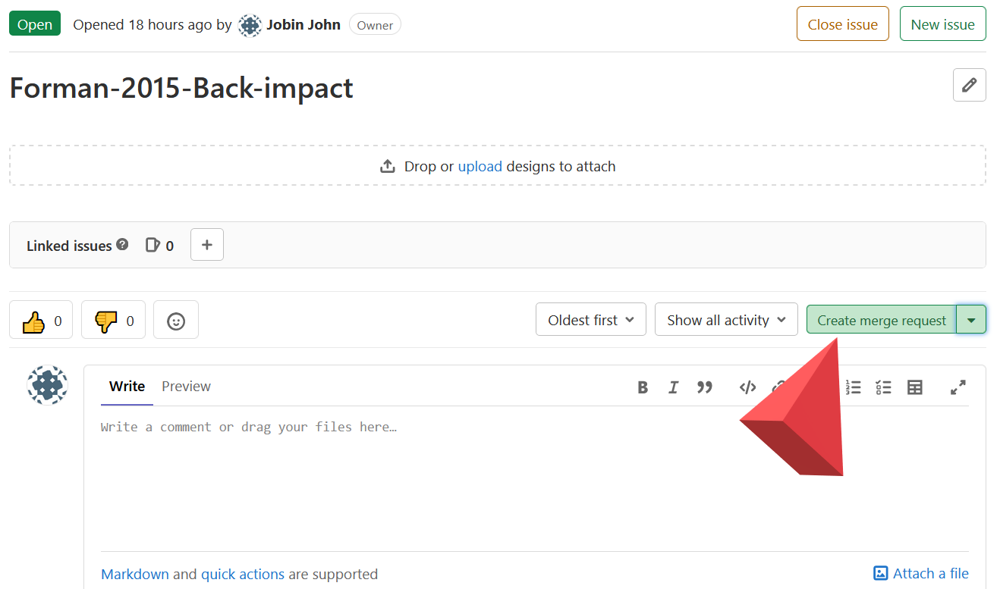

# Contributing to the Validation Catalog

All the validations for VIVA+ are documented in Jupyter notebooks. A separate repository is maintained to host all the validation load cases: [Validation Catalog](https://openvt.eu/fem/viva/vivaplus-validation)

!!! example "Golden Path: Making a validation notebook"

    - [**Getting started**](#getting-started)
        - [1. Start an issue for the new validation load case](#1-start-an-issue-for-the-new-validation-load-case)
        - [2. Create a branch](#2-create-a-branch)
    - [**Setting up your validation directory**](#setting-up-your-validation-directory)
        - [3. Get a copy of the VIVA+ Validation Repo and Validation Branch](#3-get-a-copy-of-the-viva-validation-repo-and-validation-branch)
        - [4. Start a new folder for the load case](#4-start-a-new-folder-for-the-load-case)
    - [**Postprocessing your simulations**](#postprocessing-your-simulations)
        - [5. Activate conda environment](#5-activate-conda-environment)
        - [6. Starting Jupyter](#6-starting-jupyter)
        - [7. Using Dynasaur to postprocess](#7-using-dynasaur-to-postprocess)
    - [**Preparing to publish on the VIVA+ Validation Catalog**](#preparing-to-publish-on-the-viva-validation-catalog)
        - [8. Jupyter Cell Metadata](#8-jupyter-cell-metadata)
        - [9. Ready to Merge](#9-ready-to-merge)
        - [10. Validation notebook review](#10-validation-notebook-review)
    

## **Getting started**

It's nice to let the VIVA+ community know that you are working on the validation by creating an issue on the validation catalog repository.

### 1. Start an issue for the new validation load case

Open an issue on the repo with a description of the validation case. Give a brief  title for the issue: ExperimentAuthorLastName-Year-Load-case. Limit the load case keywords to 2-4 words. (In the next step, we use an automated method to make branches and keeping a short title will give you a not-so-long 'Branch name')


### 2. Create a branch

 By working on a branch, you can work independently on your load case without other changes in the repository affecting you.

 Recommended way to create a branch is by clicking `Create Merge Request` within the issue as shown below. This keeps your branch connected to the issue you created for the load case.



## **Setting up your validation directory**

The following steps assume that you have Git installed on your system.

### 3. Get a copy of the VIVA+ Validation Repo and Validation Branch

If you don't have a copy of the validation repo on your computer, use `git clone` to start a local repo.

```
git clone https://openvt.eu/fem/viva/vivaplus-validation.git
```
After you clone the repo, checkout the branch you created in step 2 before you proceed with the rest of the steps. Replace `branch-name` with the name of the branch you created in Step 2.

```
cd vivaplus-validation # Move inside the repository
git checkout -b branch-name
```
### 4. Start a new folder for the load case

Copy `Kroell_1971-Front-hub-impact` as a template for the subdirectories and Jupyter notebook. 
Rename the folder and Jupyter notebook as `Author_YYYY-Load-case-keywords`. 
`Author-YYYY` specifies the validation experiment to reflect the publication of the experimental study. 

## **Postprocessing your simulations**

VIVA+ validations are recorded as Jupyter notebooks. Rename the serial number and notebook from the template you just copied to the same as your folder name. Postprocessing for the validation catalog is done using Python-based [Dynasaur](../user-guide/50-postprocess-dynasaur.md) library.

??? Question "If you do not have Anaconda/Miniconda Installations"

    The following steps require Anaconda/Miniconda to setup working environments. The easiest way to get started with Python is using Anaconda. You can find Anaconda installers for your Operating System at the [Anaconda webpage](https://www.anaconda.com/products/individual). 

### 5. Activate conda environment 

If you already have the necessary environment, activate it by `conda activate viva` (If you had a different name for your environment, replace `viva` with the name of your environment)

If you have not previously setup an environment, follow the steps below to setup a new environment.

??? note "Setting up a NEW conda environment for VIVA+"

    You can set up the conda environment needed for VIVA+ notebooks using the `requirements.txt` file in the `vivaplus-validation` repo that you just cloned.

    On Windows, the easiest way is to open your Anaconda command prompt and move to the `vivaplus-validation` directory. Follow the instructions below from the `vivaplus-validation` directory location in the command prompt. 


    1. Create a new conda environment with the name `viva` with Python 3.8 installed

    ```
    conda create --name viva python=3.7
    ```

    1. After you create the conda environment, activate the environment

    ```
    conda activate viva
    ```

    1. Install the required packages using pip. The packages and the required versions are specified in `requirements.txt`

    ```
    pip install -r requirements.txt
    ```


??? info "Why we use environments"

    By having a separate working environment on your system for running the validation notebooks, you can ensure that you are postprocessing using the same versions of libraries as the rest of the VIVA+ contributors. This minimizes the risk of runtime errors and makes it easy to integrate your validation notebook with the main validation catalog.

??? tip "Note to Windows Users"

    - Conda environments can be accessed from other Windows CLI (Powershell/Windows Terminal). To do so, do a one time initialization using `conda init powershell` 
    - All these work on Windows Subsystem for Linux (WSL) too. You will need to have a separate Anaconda installation for WSL. 
        

### 6. Starting Jupyter

We recommend JupyterLab as IDE (Integrated Development Environment) for Jupyter notebooks. Start JupyterLab by using this command within your conda environment 

```
jupyter lab 
```

??? Question "Other IDEs"

    Other IDEs like VSCode also provides support for Jupyter notebook. But they may not have some features we require for the Validation Catalog, like editing cell tags.

### 7. Using Dynasaur to postprocess

Adjust the links to the binouts and make the necessary figures to describe the response of the models in the loadcase. Add descriptions of the experiments and comments as necessary about the simulations.

<!-- TODO: Add note on snippets -->
## **Preparing to publish on the VIVA+ Validation Catalog**

### 8. Jupyter Cell Metadata

We use `Cell Tags` to indicate whether a text/markdown or code cell needs to be visible on the Catalog. Cell Tags are cell-level metadata.

On JupyterLab, the cell tags can be edited under the menu on the top right with the gears icon. If you started working with the Kroell/template notebook, the tags used in the validation will be able as below


- ``remove-cell`: Cell is not shown on the webpage
- `hide-input`: Hides the input, but shows the output. For example, hide the code input in code cell for producing a figure, but show the figure output
- `hide-output`: Hide the output of the cell
- `hide-cell`: Hide both the input and the output of the cell

### 9. Ready to Merge

When you are ready with your load case, inform the maintainers ready by clicking the `Mark as Ready` on the top left when you open your Merge request.

<!-- TODO: (Jobin) Update checklist -->

### 10. Validation notebook review

The VIVA+ maintainers will review your contribution and merge your load case to the validation catalog. 