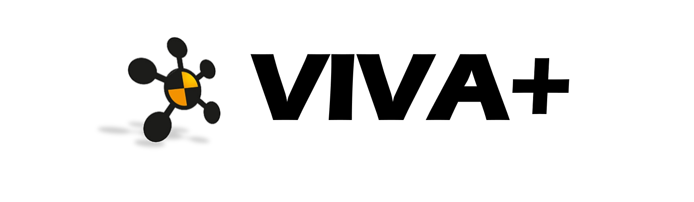

<center>**Open Finite Element Models of Human Body for Injury Assessments**</center>




Welcome to the online documentation of the VIVA+ Human Body Models! 

Here you will find information on getting started with the VIVA+ models, documentation of model implementations, and guides to make contributions to the models.

# **Getting started**

### **Models (_in beta_)** (v0.2.3)

#### Vehicle Occupant

- Average female (**50F**)
- Average male (**50F**)

#### Vulnerable Road Users (VRU)

- Average female standing (**50F**)


### **Quick Start**

Download or Clone repository from the main repo at [OpenVT](https://virtual.openvt.eu/fem/viva/vivaplus)

```
git clone https://virtual.openvt.eu/fem/viva/vivaplus.git
```

or

```
git clone git@virtual.openvt.eu:fem/viva/plus.git
```

### **Documentation**

!!! warning "Work in Progress: The VIVA+ documentation is under construction"
    
    We are in the process of writing the documentation. If you would like to 
    see specific details of the model added to the documentation, please start an issue on the repo

### **You are welcome to Contribute!**

How can you contribute?

-  **Report issues/errors** in the model
- Join the **users' community**: learn, find help and give help! [](https://vivaplus.zulipchat.com)
- Run **model validation** cases
- Would you like to try a different **material model** for a component?
- Propose **new features** for the model!
- Translate the model to **other Finite Element (FE) solvers**
- Translate the documentation into **other languages**

Find out more on how to be part of the VIVA+ community in CONTRIBUTING.md

### **License**

VIVA+ Human Body Models are Open Source ([LGPLv3](https://www.gnu.org/licenses/lgpl-3.0-standalone.html)), which means the models are freely available to use and users are free to distribute the models with the same license.

[](https://www.gnu.org/licenses/lgpl-3.0-standalone.html)


**Documentation and Validation Catalogs**

The documentation and validation catalogues are licensed under a [Creative Commons Attribution 4.0 International License](http://creativecommons.org/licenses/by/4.0/). 

[](http://creativecommons.org/licenses/by/4.0/)

