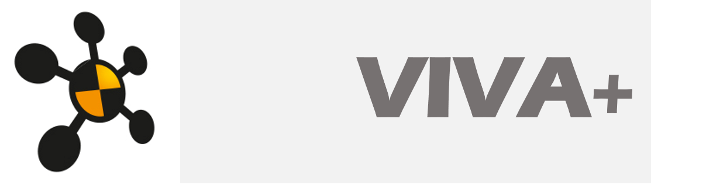

# **Open Finite Element Human Body Models**

## **Models under development**

### Vehicle Occupant Models

- Average female (**50F**)

- Average male (**50M**)

### Vulnerable Road Users (VRU)

- **Pedestrians**

- **Bicyclists**

## **Quick Start**

Clone repository from *OpenVT*

`git clone https://virtual.openvt.eu/wp-2/viva-plus.git`

## **Model Versions**

### Current stable version

- *Master branch*

### Development (research/beta) versions

- *dev branches*

## **You are welcome to Contribute!**

How can you contribute?

-  **Report issues** you encounter when running the model
- Join the **users' community**: learn, find help and give help! 
- Run extended **model validation** cases
- Would you like to try a different **material model** for a component?
- Introduce **new features** in the model!
- Translate the model to **other Finite Element (FE) solvers**
- Translate the documentation into **other languages**

Find out more on how to be part of the VIVA+ community in CONTRIBUTING.md

## **License**

**Models**

The models are licensed under [GNU Lesser General Public License, v3](https://www.gnu.org/licenses/lgpl-3.0-standalone.html)

**Documentation and Validation Catalogues**

 The documentation and validation catalogues are licensed under a <a rel="license" href="http://creativecommons.org/licenses/by/4.0/">Creative Commons Attribution 4.0 International License</a>.
