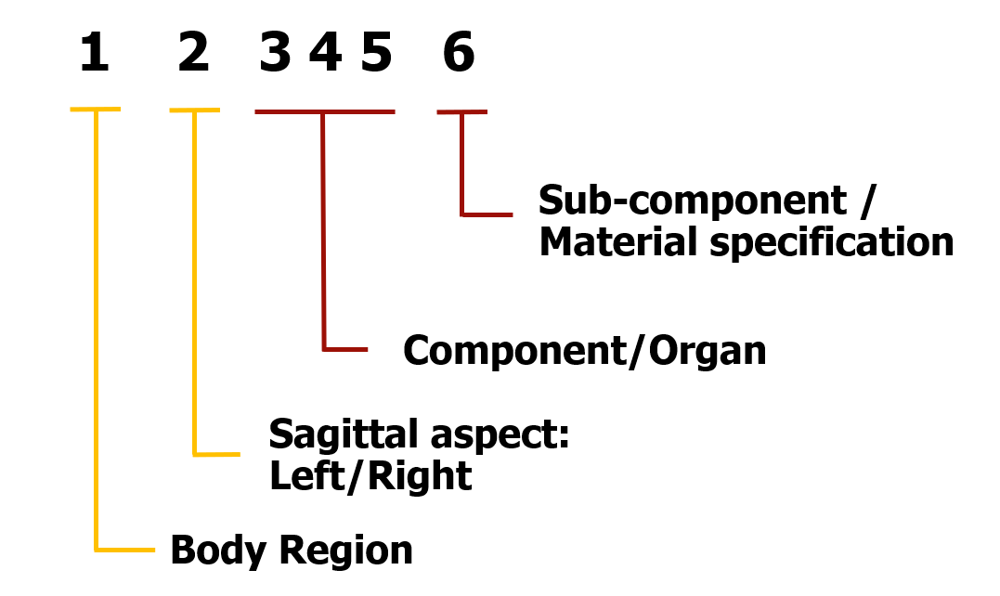
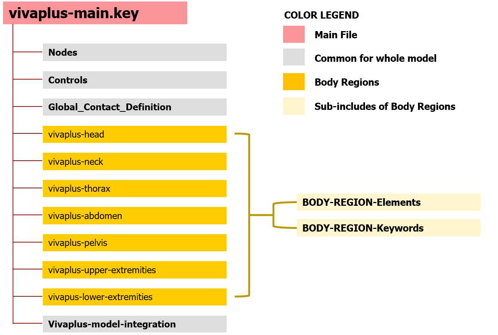

# Model Data Structure

The goal is to structure all the model data in such a way that it enables
collaborative development of the model, which is one of the motivations of having
an open model.
To facilitate this, we try to have identifiers of model data to be persistent (does not change over time) and
unique (no mismatches or clashes).

A brief overview of identifier numbering scheme for the model parts and include
file structuring of the model data is given below.

## Identifiers

The primary identifier for any model data (part, section, material definition,
  curves) is a six-digit number that locates the anatomical entity that the
  data pertains to. Moving from left to right of the identifier locates the component with increasing specificity. The hierarchy in the identifier follows the order: Body region, sagittal aspect (left/right), component/organ within the body region, sub-components (to be used if detailed geometric and material definitions are required for a component).



**A generalized identifier reference is given in each section corresponding
to the body regions/components.** An overview of the numbering scheme is given below.

<!-- !!! Tip "Identifiers: Just look 'em up!"
    > "Never memorize something that you can look up"

    > [Albert Einstein](https://quoteinvestigator.com/2012/04/02/know-where-to-find/) -->

### Body regions

The whole body is segmented into seven regions to define the body region identifiers.

| **Identifier** | **Body Region**   |
|---------------:|-------------------|
|              1 | Head              |
|              2 | Neck              |
|              3 | Upper Extremities |
|              4 | Thorax            |
|              5 | Abdomen           |
|              6 | Pelvis            |
|              7 | Lower Extremities |

The torso is divided into three regions: thoracic, abdominal, and pelvic segments.[^1] The spinal column follows the range of their corresponding body segment, for example, the lumbar spine is included as part of the abdominal segment.

[^1]: https://en.wikipedia.org/w/index.php?title=Torso&oldid=939901603 (accessed on 09 March 2020)

### Sagittal Aspect (Left/Right side of the body)

The position of the anatomical entity with respect to the mid-sagittal plane, i.e. left or right side of body, is described by the second digit of the identifier.

**Sagittal Aspect** | **Sagittal Aspect**
:------------------:|:------------------:
     X 0 XXX X      |        Left
     X 5 XXX X      |        Right

The left and right extremities follow the same numbering scheme, rather than separate body region identifier. Hence, symmetric components will have identifiers that are offset by 50,000.

??? Info "Anatomical Planes and Axis"

    

    Image Source: [Wikimedia](https://commons.wikimedia.org/w/index.php?curid=17280382)

Components located on the mid-sagittal plane will have a default value of 0, unless further sub-division is required for the sake of post-processing. For instance, separate output for responses of right and left halves of the intervertebral disc or spinal ligaments may be of interest in side/oblique impact, in which case, the components can be defined as different parts using this numbering system.

Node numbering will also follow the same numbering scheme as the body region and sagittal aspect.

### Component/Organ

The third and fourth digits of the identifier is used to describe components/organs in respective body regions. The fifth digit is used to identify a sub-component of the anatomical entity, e.g., cortical and trabecular bone. This allows for sub-components to be represented within a component under a common identifier.

The component identifier for a body region is numbered in increasing order from superior to inferior direction. If multiple components are present at the same level, the components are numbered from the medial to lateral direction in the supine position and anterior to posterior.
An example of the left upper extremity skeletal system is given below.

**Component Identifier** | **Description**
------------------------:|:----------------
               30 1 10 0 | Clavicle
               30 1 20 0 | Scapula
               30 1 30 0 | Humerus
               30 1 40 0 | Ulna
               30 1 50 0 | Radius
   30 1 60 0 – 30 2 30 0 | Carpal Bones
   30 2 40 0 – 30 2 80 0 | Metacarpal Bones
   30 2 90 0 – 30 3 20 0 | Phalanges

### Material specification
In the current version materials are only specified once per region to avoid redundancies during the development process. At a later stage it is planned to have one material card per part, so that PID=MID.

| last digit | type            |
|------------|-----------------|
| 1          | cortical        |
| 2          | trabecular      |
| 3          | rigid           |
| 4          | null            |
| 5          | skin            |
| 6          | muscle          |
| 7          | fat/soft tissue |

Rigidified parts of bones that are used for joint definitions are separated into an extra part (marked with 3 as last digit) to avoid that rigid elements are included in postprocessing routines.

## Include file structure

### General Structure



<!-- ### Include File Tree

```
vivaplus-50F/M
├── vivaplus-controls.key
├── vivaplus-global-contact.key
├── vivaplus-joints.key
├── vivaplus-Neck-Muscles.key
└── vivaplus_50F_nodes.key
``` -->
